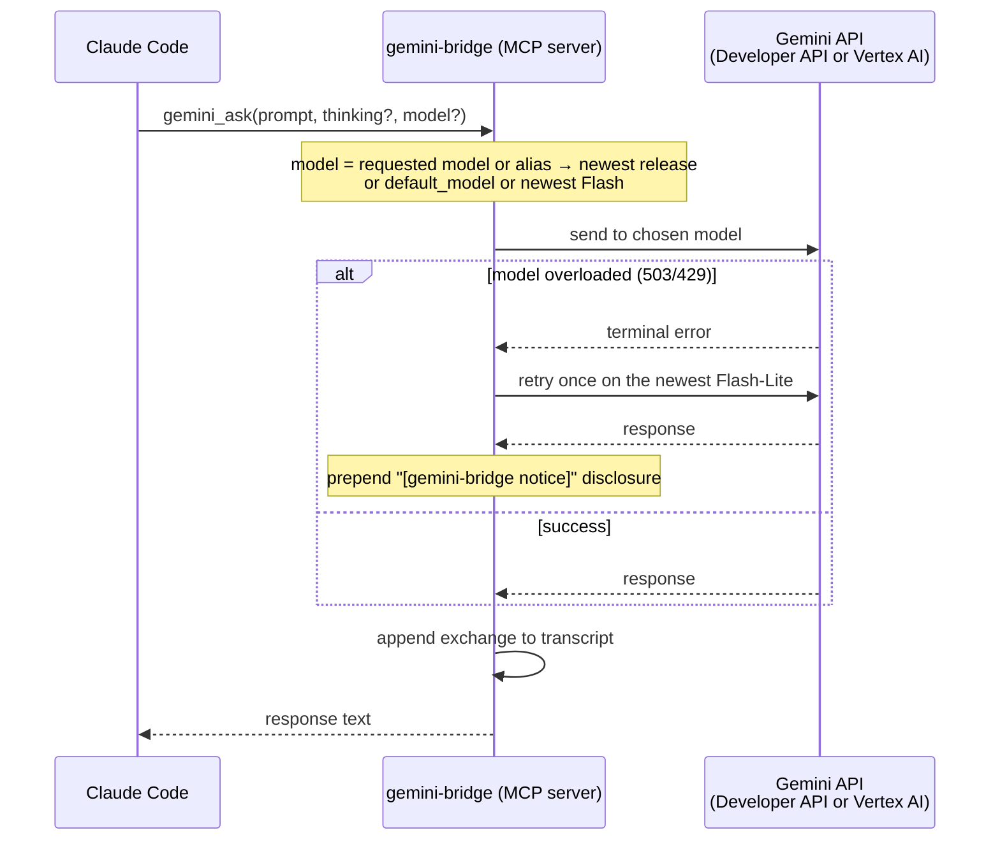

<h1 align="center">gemini-bridge</h1>
<h4 align="center">Gemini as a live sounding board for Claude Code — Vertex AI, persistent sessions, structured logging.</h4>

<p align="center">
  
  
  
  
  
</p>

gemini-bridge is an MCP server that gives Claude Code a live Gemini counterpart. When Claude is working on a hard problem — an architectural decision, a tricky bug, a code review — it can consult Gemini as a second opinion without switching tools or context.

Sessions persist across all tool calls within a Claude Code session. Gemini accumulates context naturally across tools and turns. Every exchange is appended to a dated Markdown transcript file. The server logs to a daily rotating file so you can watch it live.

Five focused tools, each with a distinct system prompt persona. Not a 37-tool Swiss Army knife.

**Quick navigation:** [What it does](#what-it-does) | [How it works](#how-it-works) | [Prerequisites](#prerequisites) | [Quick start](#quick-start) | [Configuration](#configuration) | [Choosing a model](#choosing-a-model) | [Auth methods](#auth-methods) | [Thinking levels](#thinking-levels) | [Roadmap](#roadmap) | [Full documentation](#full-documentation)

---

## What it does

| Tool | Persona | Required parameters |
|---|---|---|
| `gemini_ask` | Direct, precise — general purpose | `prompt` |
| `gemini_brainstorm` | Devil's advocate, unconventional | `topic` |
| `gemini_review` | Critical, severity-first | `content` |
| `gemini_debug` | Evidence-based, hypothesis-driven | `error` |
| `gemini_architect` | Opinionated, explicit tradeoffs | `description` |

All five inference tools share optional `thinking` (`none`/`low`/`medium`/`high`), `session_name`, and `model` parameters. Claude picks thinking level based on question complexity, and may pick a `model` per call (omit for the server default).

A sixth utility tool, **`gemini_list_models`**, returns the chat-capable models available on your active backend — use it to discover valid `model=` values. See [Choosing a model](#choosing-a-model).

**Web access:** Gemini can search the web and fetch URLs using the Gemini API's built-in `google_search` and `url_context` — pass `web=true` on any tool, or set `"web_tools": {"enabled": true}`. Off by default (grounding bills per request). **While web access is on, `write_file` is withheld**: retrieved pages are attacker-controlled text, and a call that can both read the web and write your repo is a prompt-injection path. Searches and their sources are recorded in the transcript. See [docs/tools.md](docs/tools.md#web-access).

**Repository access:** Gemini can read the repo Claude Code was launched in — `list_dir`, `glob`, `grep`, `read_file` for all five inference tools, plus `write_file` for `brainstorm`, `architect`, and `review`. Everything is confined to the launch directory: `..`, outside absolute paths, and symlink escapes are rejected, and `.git`, `.env*`, keys, and credential files are denied. Nothing is ever executed. Every file operation is logged in the transcript. Turn it all off with `"file_tools": {"enabled": false}`. The server advertises all of this to the calling MCP client — server instructions, per-tool descriptions, and `destructiveHint` on the write-capable tools — so Claude knows to name paths rather than paste files, and knows which calls can touch the working tree. See [docs/tools.md](docs/tools.md#repository-access).

**Artifacts:** `gemini_architect` and `gemini_review` save each answer to `gemini-artifacts/YYYYMMDD-HHMM-<tool>-<topic>.md` (pass `write_artifact=false` to skip). `gemini_brainstorm` saves only with `write_artifact=true`. The reply ends with the saved path.

**Session model:** One Gemini chat session per tool name per Claude Code process. Context accumulates naturally within a session — later calls can reference earlier ones. Changing `model` starts a separate session (sessions are keyed by tool + name + model).

**Transcript logging:** Every exchange appended to `{transcript_dir}/YYYYMMDD-HHMM-gemini-bridge-transcript.md`.

**Server logging:** Structured logs at `~/.config/gemini-bridge/logs/YYYYMMDD-gemini-bridge.log`. See [docs/logging.md](docs/logging.md).

---

## How it works



---

## Prerequisites

| Requirement | Notes |
|---|---|
| Python 3.11+ | `python3 --version` |
| Claude Code | MCP-enabled version |
| Auth | **API key (easiest):** `export GEMINI_API_KEY="..."` — get one at [aistudio.google.com/apikey](https://aistudio.google.com/apikey), no GCP needed · **Vertex AI:** ADC, SA key file, or Apple Keychain — requires gcloud CLI + GCP project — see [Auth methods](#auth-methods) |

---

## Quick start

```bash
# 1. Clone and install
git clone https://github.com/PCS-LAB-ORG/gemini-bridge.git
cd gemini-bridge
python3 -m pip install -e .

# 2. Configure (interactive wizard — reads existing config as defaults on re-run)
bash setup.sh

# 3. Register with Claude Code
#    API key auth (easiest). Export the key first — keep the quotes, keys can
#    contain shell-special characters — then reference it with -e so it lands in
#    the server's own environment. The server name 'gemini-bridge' MUST come
#    first: omit it and 'claude mcp add' treats 'python3' as the name and the
#    server shows up as "python3: -m gemini_bridge - ✘ Failed to connect".
export GEMINI_API_KEY="your-key-here"
claude mcp add gemini-bridge -s user -e GEMINI_API_KEY="$GEMINI_API_KEY" -- python3 -m gemini_bridge

#    Vertex AI auth (adc / env / keychain) instead? Drop the -e flag:
#    claude mcp add gemini-bridge -s user -- python3 -m gemini_bridge

# 4. Verify
claude mcp list
```

Restart Claude Code after step 3. On next start you'll see startup entries in the log:

```
[gemini-bridge] 17:50:10 INFO  gemini_bridge.__main__: starting — auth=keychain location=global default_thinking=medium default_model=gemini-3.8-flash fallback_model=gemini-3.5-flash-lite
[gemini-bridge] 17:50:10 INFO  gemini_bridge.__main__: transcript → ~/session-summaries/20260702-1750-gemini-bridge-transcript.md
```

---

## Configuration

**Config file:** `~/.config/gemini-bridge/config.json` — created by `setup.sh`, safe to edit by hand.

| Field | Default | Description |
|---|---|---|
| `project` | — | GCP project ID (required for `adc`/`env`/`keychain`; omit for `api_key`) |
| `location` | `global` | Vertex AI location; `global` is recommended and works for all models; omit for `api_key` |
| `default_thinking` | `medium` | Thinking level when omitted per call |
| `default_model` | *(newest Flash)* | Model for calls that omit `model=`: an alias (`flash` / `flash-lite` / `pro`) or a concrete id. Unset → newest Flash, resolved at startup. Per-call `model=` always overrides |
| `transcript_dir` | `./session-summaries` | Transcript directory; relative paths resolve to the project root where Claude Code was launched |
| `artifacts_dir` | `./gemini-artifacts` | Where architect/review (and opted-in brainstorm) answers are saved; must be inside the project root |
| `file_tools.enabled` | `true` | Kill switch for Gemini's repository access |
| `file_tools.deny` | secrets list | Paths Gemini may never read or write (replaces the default list when set) |
| `file_tools.max_write_bytes` | `262144` | Size cap for a single `write_file` |
| `auth.method` | `adc` | `adc` · `env` · `keychain` · `api_key` |
| `auth.keychain_service` | `gemini-bridge` | Keychain service name (`keychain` only) |
| `auth.keychain_account` | `vertex-sa` | Keychain account name (`keychain` only) |
| `auth.api_key_env` | `GEMINI_API_KEY` | Env var name holding the AI Studio key (`api_key` only; key is never stored in config) |

> **Note:** Leave `default_model` unset to always get the newest Flash, set it to an alias
> (`flash` / `flash-lite` / `pro`) to track a family, or to a concrete id to pin one. Individual
> calls always override it **per call** via `model=`. See [Choosing a model](#choosing-a-model).

See [docs/configuration.md](docs/configuration.md) for the full field reference.

---

## Choosing a model

Every tool accepts an optional `model=` parameter. **Omit it and you get the newest Flash** — the
bridge reads the live model list once at startup and picks the highest version (e.g.
`gemini-3.8-flash`), so a new Gemini release is picked up by restarting the MCP server, with no
code or config change.

| You pass | You get |
|---|---|
| *(nothing)* | `default_model` from config if set, else the newest Flash |
| `flash` · `flash-lite` · `pro` | the newest release of that family (`pro` may be a preview when no GA Pro is newer) |
| `gemini-flash-latest` · `gemini-flash-lite-latest` · `gemini-pro-latest` | same as the short alias — translated by the bridge, so they also work on **Vertex AI** |
| a concrete id, e.g. `gemini-3.5-flash` | exactly that model, never rewritten |

- **Fallback:** on a terminal overload (503/429) the call is retried once on the newest
  Flash-Lite, with a visible `[gemini-bridge notice]`.
- **Offline:** if the model list can't be read at startup, the bridge uses pinned known-good
  defaults (`gemini-3.5-flash`, fallback `gemini-3.1-flash-lite`) and logs a warning.
- **Visibility:** the startup log, transcripts, and artifacts always name the concrete model
  (never an alias). `gemini_list_models` marks the default and the newest model per family.
- **Thinking levels:** the bridge picks the right API parameter per model and adapts when a
  model rejects a level (e.g. `gemini-3.8-flash` refuses the lowest level, so `thinking="none"`
  steps up to `low`). See [docs/configuration.md](docs/configuration.md#choosing-a-model).

---

## Auth methods

Four methods supported — `setup.sh` walks you through all of them.

**ADC (recommended for personal machines):**
```bash
gcloud auth application-default login
# Sets method: "adc" in config
```
One-time setup. SDK auto-refreshes. Note: `gcloud auth login` (CLI) and ADC are separate credential stores — see [docs/auth.md](docs/auth.md).

**Env file (service account key on disk):**
```bash
export GOOGLE_APPLICATION_CREDENTIALS=/path/to/sa-key.json
# Sets method: "env" in config
```
Set the env var before starting Claude Code. Key file stays on disk — use only on full-disk-encrypted machines.

**Apple Keychain (recommended for DLP-sensitive environments, macOS only):**
```bash
security add-generic-password \
  -s "gemini-bridge" -a "vertex-sa" \
  -w "$(cat /path/to/sa-key.json)"
rm /path/to/sa-key.json   # remove disk copy
# Sets method: "keychain" in config
```
SA JSON loaded to memory at startup; zero disk artifact after store. `setup.sh` verifies the item exists and contains valid JSON before writing config.

**API key (Google AI Studio — no GCP project needed):**
```bash
# setup.sh sets method: "api_key" in config. Then register the server, passing
# the key with -e so it reaches the MCP subprocess (a bare shell export does
# NOT reliably propagate to it). Keep the quotes — keys can contain shell-
# special characters — and put the server name 'gemini-bridge' first.
export GEMINI_API_KEY="your-key-here"
claude mcp add gemini-bridge -s user -e GEMINI_API_KEY="$GEMINI_API_KEY" -- python3 -m gemini_bridge
```
Get a key at [aistudio.google.com/apikey](https://aistudio.google.com/apikey). No GCP project, no `gcloud` setup. Lower quota limits than Vertex AI — suitable for personal use and quick setup. The key is injected into the server's environment via `-e` and stored in Claude Code's MCP config; it is never written to gemini-bridge's `config.json`.

**Minimum GCP role for service account:** `roles/aiplatform.user` (renamed from "Vertex AI Platform User" to "Agent Platform User" in 2026 — same role ID `roles/aiplatform.user`). Not required for `api_key` mode.

---

## Thinking levels

Claude picks per call based on question complexity. See [docs/tools.md](docs/tools.md) for full tool documentation.

| Level | Gemini 2.x (`thinking_budget`) | Gemini 3.x (`thinking_level`) |
|---|---|---|
| `none` | 0 tokens | MINIMAL |
| `low` | 1024 tokens | LOW |
| `medium` | 8192 tokens | MEDIUM |
| `high` | 32768 tokens | HIGH |

---

## Roadmap

| Release | Status | Highlights |
|---|---|---|
| 26.7.1 | ✓ Shipped | 5 tools · ADC, env + Keychain auth · persistent sessions · transcript logging · structured logging · full docs |
| 26.7.2 | Planned | Named sessions · per-project transcript routing · Google AI Studio API key auth |

See [docs/roadmap.md](docs/roadmap.md) for full phase breakdown and rationale.

---

## Full documentation

See [docs/README.md](docs/README.md) for the complete documentation index.
