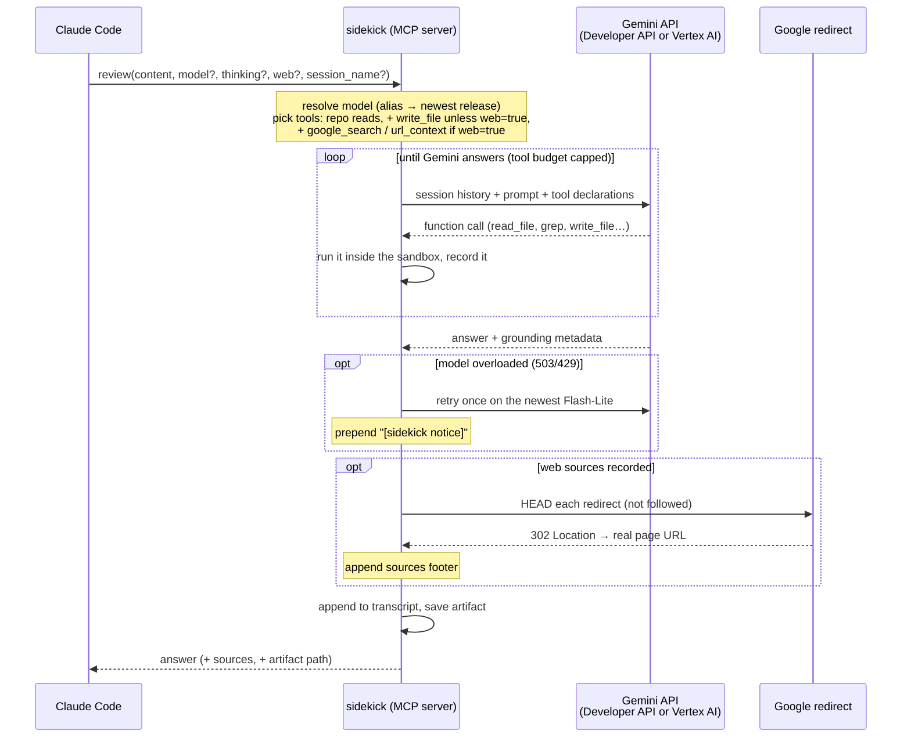

<h1 align="center">sidekick</h1>
<h4 align="center">Gemini as a live second opinion for Claude Code — reads your repo, searches the web with real sources, keeps sessions and transcripts.</h4>

<p align="center">
  
  
  
  
  
  
</p>

sidekick is a Claude Code plugin that gives Claude a live Gemini counterpart. When Claude is working on a hard problem — an architectural decision, a tricky bug, a code review — it can consult Gemini as a second opinion without switching tools or context.

Gemini isn't limited to what Claude pastes into the call. It reads the repository itself, inside a sandbox. It can search the web, and each web answer comes back with the sources it actually used. Conversations persist across calls, every exchange lands in a Markdown transcript, and the server logs to a daily file you can tail.

Five focused tools, each with its own persona, plus three utilities. Not a 37-tool Swiss Army knife.

**Quick navigation:** [What it does](#what-it-does) | [How it works](#how-it-works) | [Prerequisites](#prerequisites) | [Quick start](#quick-start) | [Configuration](#configuration) | [Choosing a model](#choosing-a-model) | [Auth methods](#auth-methods) | [Thinking levels](#thinking-levels) | [Roadmap](#roadmap) | [Full documentation](#full-documentation)

---

## What it does

| Tool | Persona | Required parameter | Can write files? |
|---|---|---|---|
| `ask` | Direct, precise — general purpose | `prompt` | no |
| `brainstorm` | Devil's advocate, unconventional | `topic` | yes |
| `review` | Critical, severity-first | `content` | yes |
| `debug` | Evidence-based, hypothesis-driven | `error` | no |
| `architect` | Opinionated, explicit tradeoffs | `description` | yes |
| `list_models` | Lists the chat models on your backend, for `model=` | — | no |
| `list_sessions` | Lists the conversations in memory (tool, `session_name`, model, turns), to find one to continue | — | no |
| `help` | Claude's `--help`: full detail by topic | — | no |

**Parameters on the five generating tools** (all optional):

| Parameter | What it does |
|---|---|
| `session_name` | Same name continues a Gemini conversation; a new name starts fresh. Sessions are separate per tool and per model, and live until the server restarts. `list_sessions` shows the live ones |
| `thinking` | `none` · `low` · `medium` · `high`. Omit it to use `default_thinking` |
| `model` | A concrete id, or `flash` / `flash-lite` / `pro` for the newest of that family. See [Choosing a model](#choosing-a-model) |
| `web` | `true` lets Gemini search the web and fetch URLs for this call. Omit it to use `web_tools.enabled` (off by default) |
| `write_artifact` | Save the answer as a Markdown file. On by default for `review` and `architect`, off for `brainstorm` |

**Repository access.** Gemini reads the repo Claude Code was launched in with `list_dir`, `glob`, `grep` and `read_file`. The three write-capable tools also get `write_file`, which can create or overwrite files but never delete, rename or execute anything. Everything stays inside the launch directory: `..`, absolute paths outside it and symlink escapes are rejected, and `.git`, `.env*`, keys and credential files are denied. Every file operation is logged in the transcript. Turn it all off with `"file_tools": {"enabled": false}`. See [docs/tools.md](docs/tools.md#repository-access).

**Web access.** With `web=true`, Gemini uses the Gemini API's built-in `google_search` and `url_context`. It's off by default because grounding is billed per request, and it works only on the Developer API (API key); on Vertex the bridge drops it with a notice. Two safeguards come with it:
- **Web and `write_file` are mutually exclusive.** A call with web on has no `write_file`, because retrieved pages are attacker-controlled text. Retrieved page text is also stripped from session history, so it can't ride into a later call that can write.
- **Sources come from the API, not from Gemini.** Every web answer ends with the sources recorded in Google's grounding metadata. Each one is resolved from Google's redirect link to the real page URL with a single `HEAD` request, which costs zero Gemini tokens. Gemini is told not to type URLs of its own, because when it does they're plausible and wrong.

See [docs/tools.md](docs/tools.md#web-access).

**What Claude is told.** Claude Code keeps only about the first 2048 characters of a server's instructions, so the bridge sends a short overview: the tools, what they can read and write, the web rules, and the parameters. The rest is one `help(topic=...)` call away, with topics `tools`, `files`, `web`, `sessions`, `disk` or a tool name. Every tool's description and MCP annotations (`destructiveHint` on the write-capable tools) are built from the live configuration, so what Claude is told always matches what the server does.

**Artifacts.** `review` and `architect` save each answer to `sidekick-artifacts/YYYYMMDD-HHMM-<tool>-<topic>.md` unless called with `write_artifact=false`. `brainstorm` saves only with `write_artifact=true`. The reply ends with the saved path.

**Transcripts and logs.** Every exchange, including each file operation, web search and source, is appended to `{transcript_dir}/YYYYMMDD-HHMM-sidekick-transcript.md`; see [docs/transcripts.md](docs/transcripts.md). Server logs go to `~/.config/sidekick/logs/YYYYMMDD-sidekick.log`; see [docs/logging.md](docs/logging.md).

---

## How it works



---

## Prerequisites

| Requirement | Notes |
|---|---|
| [uv](https://docs.astral.sh/uv/) | `uv --version`; `/sidekick:setup` offers to install it. uv fetches its own Python, so you don't need Python installed separately to run the plugin |
| Claude Code | MCP-enabled version |
| Auth | **API key (easiest):** `export GEMINI_API_KEY="..."` — get one at [aistudio.google.com/apikey](https://aistudio.google.com/apikey), no GCP needed · **Vertex AI:** ADC, SA key file, or Apple Keychain — requires gcloud CLI + GCP project — see [Auth methods](#auth-methods) |

---

## Quick start

```
/plugin marketplace add FlintAndFilament/sidekick
/plugin install sidekick@sidekick
/sidekick:setup
```

Requires [uv](https://docs.astral.sh/uv/); `/sidekick:setup` offers to install it.
api_key users: export your key (e.g. `export GEMINI_API_KEY="…"`) in the shell that starts Claude Code,
or read it from the macOS Keychain with a launch alias ([docs/auth.md](docs/auth.md#method-4-api-key-google-ai-studio)).
Windows: not yet tested end to end.

**Updating:** `/plugin update` opens a menu, so the CLI is quicker:
```bash
claude plugin marketplace update sidekick && claude plugin update sidekick@sidekick
```
then run `/reload-plugins` in Claude Code (or restart it). Coming from gemini-bridge? Read the
upgrade note in [docs/roadmap.md](docs/roadmap.md) first.

## Configuration

**Config file:** `~/.config/sidekick/config.json` — created by `/sidekick:setup`, safe to edit by hand.

| Field | Default | Description |
|---|---|---|
| `project` | — | GCP project ID (required for `adc`/`env`/`keychain`; omit for `api_key`) |
| `location` | `global` | Vertex AI location; `global` is recommended and works for all models; omit for `api_key` |
| `default_thinking` | `medium` | Thinking level when omitted per call |
| `default_model` | *(newest Flash)* | Model for calls that omit `model=`: an alias (`flash` / `flash-lite` / `pro`) or a concrete id. Unset → newest Flash, resolved at startup. Per-call `model=` always overrides |
| `transcript_dir` | `./session-summaries` | Transcript directory; relative paths resolve to the project root (`CLAUDE_PROJECT_DIR`, falling back to the working directory) |
| `artifacts_dir` | `./sidekick-artifacts` | Where architect/review (and opted-in brainstorm) answers are saved; must be inside the project root |
| `file_tools.enabled` | `true` | Kill switch for Gemini's repository access |
| `file_tools.deny` | secrets list | Paths Gemini may never read or write (replaces the default list when set) |
| `file_tools.max_write_bytes` | `262144` | Size cap for a single `write_file` |
| `web_tools.enabled` | `false` | Default for each call's `web` argument. Grounding is billed per request; Developer API (API key) only |
| `auth.method` | `adc` | `adc` · `env` · `keychain` · `api_key` |
| `auth.keychain_service` | `sidekick` | Keychain service name (`keychain` only) |
| `auth.keychain_account` | `vertex-sa` | Keychain account name (`keychain` only) |
| `auth.api_key_env` | `GEMINI_API_KEY` | Env var name holding the AI Studio key (`api_key` only; key is never stored in config) |

> **Note:** Leave `default_model` unset to always get the newest Flash, set it to an alias
> (`flash` / `flash-lite` / `pro`) to track a family, or to a concrete id to pin one. Individual
> calls always override it **per call** via `model=`. See [Choosing a model](#choosing-a-model).

See [docs/configuration.md](docs/configuration.md) for the full field reference.

---

## Choosing a model

Every tool accepts an optional `model=` parameter. **Omit it and you get the newest Flash** — the
bridge reads the live model list once at startup and picks the highest version (e.g.
`gemini-3.8-flash`), so a new Gemini release is picked up by restarting the MCP server, with no
code or config change.

| You pass | You get |
|---|---|
| *(nothing)* | `default_model` from config if set, else the newest Flash |
| `flash` · `flash-lite` · `pro` | the newest release of that family (`pro` may be a preview when no GA Pro is newer) |
| `gemini-flash-latest` · `gemini-flash-lite-latest` · `gemini-pro-latest` | same as the short alias — translated by the bridge, so they also work on **Vertex AI** |
| a concrete id, e.g. `gemini-3.5-flash` | exactly that model, never rewritten |

- **Fallback:** on a terminal overload (503/429) the call is retried once on the newest
  Flash-Lite, with a visible `[sidekick notice]`.
- **Offline:** if the model list can't be read at startup, the bridge uses pinned known-good
  defaults (`gemini-3.5-flash`, fallback `gemini-3.1-flash-lite`) and logs a warning.
- **Visibility:** the startup log and artifacts always name the concrete model (never an
  alias); transcripts don't record the model. `list_models` marks the default and the newest model per family.
- **Thinking levels:** the bridge picks the right API parameter per model and adapts when a
  model rejects a level (e.g. `gemini-3.8-flash` refuses the lowest level, so `thinking="none"`
  steps up to `low`). See [docs/configuration.md](docs/configuration.md#choosing-a-model).

---

## Auth methods

Four methods supported — `/sidekick:setup` walks you through all of them.

**ADC (recommended for personal machines):**
```bash
gcloud auth application-default login
# Sets method: "adc" in config
```
One-time setup. SDK auto-refreshes. Note: `gcloud auth login` (CLI) and ADC are separate credential stores — see [docs/auth.md](docs/auth.md).

**Env file (service account key on disk):**
```bash
export GOOGLE_APPLICATION_CREDENTIALS=/path/to/sa-key.json
# Sets method: "env" in config
```
Set the env var before starting Claude Code. Key file stays on disk — use only on full-disk-encrypted machines.

**Apple Keychain (recommended for DLP-sensitive environments, macOS only):**
```bash
security add-generic-password \
  -s "sidekick" -a "vertex-sa" \
  -w "$(cat /path/to/sa-key.json)"
rm /path/to/sa-key.json   # remove disk copy
# Sets method: "keychain" in config
```
SA JSON loaded to memory at startup; zero disk artifact after store. `/sidekick:setup` verifies the item exists and contains valid JSON before writing config.

**API key (Google AI Studio — no GCP project needed):**
```bash
# The plugin's MCP server inherits Claude Code's own environment directly — no
# registration flag injects it. Export the key in the shell PROFILE of the shell
# that starts Claude Code (e.g. ~/.zshrc or ~/.bashrc), not just the current shell,
# then run /sidekick:setup and choose api_key. Claude Code launched from a
# GUI/desktop app may not see shell-profile exports — launch it from a terminal
# instead if the key isn't found.
export GEMINI_API_KEY="your-key-here"
```
Get a key at [aistudio.google.com/apikey](https://aistudio.google.com/apikey). No GCP project, no `gcloud` setup. Lower quota limits than Vertex AI — suitable for personal use and quick setup. The key is read from the server's inherited environment at startup; it is never written to sidekick's `config.json`.

**Minimum GCP role for service account:** `roles/aiplatform.user` (renamed from "Vertex AI Platform User" to "Agent Platform User" in 2026 — same role ID `roles/aiplatform.user`). Not required for `api_key` mode.

---

## Thinking levels

Claude picks per call based on question complexity. See [docs/tools.md](docs/tools.md) for full tool documentation.

| Level | Gemini 2.x (`thinking_budget`) | Gemini 3.x (`thinking_level`) |
|---|---|---|
| `none` | 0 tokens | MINIMAL |
| `low` | 1024 tokens | LOW |
| `medium` | 8192 tokens | MEDIUM |
| `high` | 32768 tokens | HIGH |

---

## Roadmap

Shipped since the first release: named sessions and per-call models, newest-model resolution with overload fallback, API key auth, repository file tools, capability metadata for the MCP client, web access with resolved sources, `help`, the Claude Code plugin, and `list_sessions` (0.4.0). Open work is tracked in [GitHub issues](https://github.com/FlintAndFilament/sidekick/issues).

See [docs/roadmap.md](docs/roadmap.md) for what shipped when, and why.

---

## Full documentation

See [docs/README.md](docs/README.md) for the complete documentation index.
