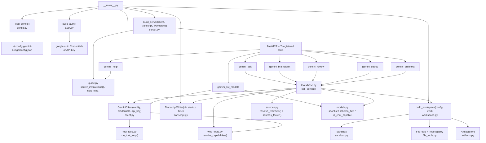
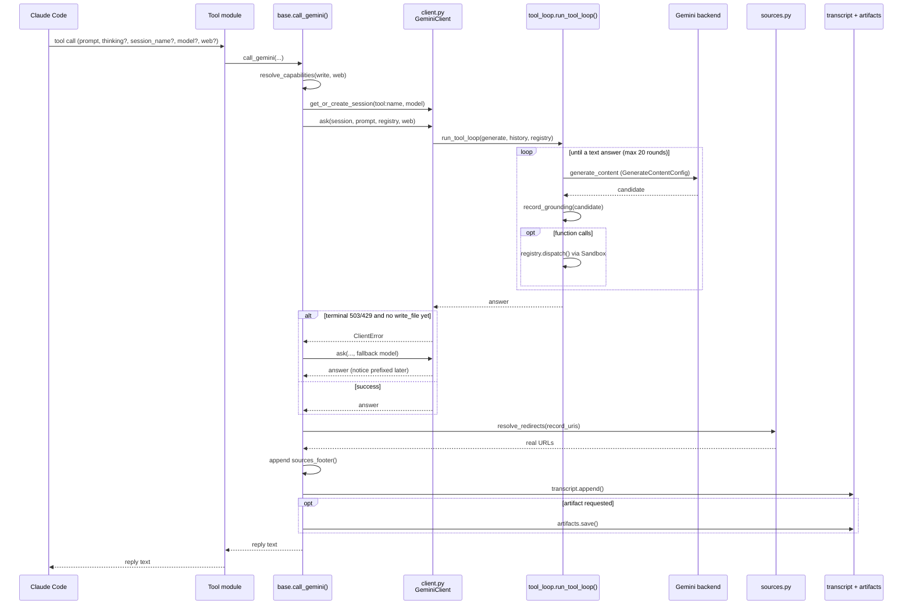

# Architecture

## Component Diagram

The five generating tools route through `call_gemini()` in `tools/base.py`.
`gemini_list_models` calls the client directly and never writes a transcript.
`gemini_help` never calls the backend: `server.py` hands it a callable that renders text
from `guide.py`.

## Module Map

Package root: `src/gemini_bridge/`.

| Module | Responsibility | Depends on (in-package) |
|---|---|---|
| `__init__.py` | Package identity only | none |
| `__main__.py` | Startup: logging (daily file + stderr), config, auth, client, `refresh_latest()`, transcript, workspace, server; exits 1 on a config, auth or `artifacts_dir` error | config, auth, client, transcript, workspace, sandbox, server |
| `config.py` | Pydantic models `Config`, `AuthConfig`, `FileToolsConfig`, `WebToolsConfig`; loads and validates `config.json`; raises `ConfigError` | sandbox (`DEFAULT_DENY`) |
| `auth.py` | Credentials for `adc`, `env`, `keychain` and `api_key`; `build_auth()` returns `AuthResult(credentials, api_key)`; raises `AuthError` | config |
| `errors.py` | `ClientError`, in its own module so `client.py` and `tool_loop.py` can both raise it | none |
| `models.py` | Model taxonomy: per-backend shortlist, backend detection, schema hint, chat-capable filter, newest-per-family resolution, alias mapping. Pure, no I/O | none |
| `client.py` | `GeminiClient`: builds the google-genai client, LRU session cache (50), model resolution, thinking translation that learns per-model rejections, 503/429 retry with backoff, `build_config()`, `ask()` | config, errors, models, tool_loop, web_tools |
| `tool_loop.py` | `ToolRegistry`, `ToolCallRecord`, `run_tool_loop()` (up to 20 rounds, then a forced answer), `record_grounding()` for server-side web activity | errors |
| `sandbox.py` | Path confinement: resolves every model-supplied path inside the root, applies the deny-list at any depth, walks without leaving the root | none |
| `file_tools.py` | `list_dir`, `glob`, `grep`, `read_file`, `write_file` on top of `Sandbox`, with result and size caps; publishes them to a `ToolRegistry` (read-only or read+write) | sandbox, tool_loop |
| `artifacts.py` | `ArtifactStore`: saves a final answer as `<YYYYMMDD-HHMM>-<tool>-<slug>.md`, never overwriting | none |
| `workspace.py` | `Workspace`: Sandbox rooted at the launch directory, `FileTools`, per-call registry, `ArtifactStore`. Disables file tools when the root is home, `/`, or an ancestor of home | config, sandbox, file_tools, tool_loop, artifacts |
| `web_tools.py` | `resolve_capabilities()`: decides web and write for a call, never both (#76). `web_tool_set()`: the `google_search` + `url_context` built-ins | none |
| `sources.py` | Resolves Google grounding redirect links to real URLs with one HEAD request each (no redirect follow, 3 s timeout, in parallel); renders the sources footer (#80, #82) | tool_loop (`ToolCallRecord`) |
| `transcript.py` | `TranscriptWriter`: appends each exchange as Markdown; write errors are logged, never raised | none |
| `guide.py` | Text only: the short server instructions (kept under `INSTRUCTIONS_BUDGET` = 2000 characters) and the `gemini_help` topics, all derived from the live capability rows, deny-list, caps and web support (#74, #78) | tools, tools/base, file_tools, sandbox, web_tools, workspace, transcript |
| `server.py` | Builds `FastMCP` with the guide's instructions and registers all 7 tools | client, guide, tools, transcript, workspace |

Tools package: `src/gemini_bridge/tools/`.

| Module | Responsibility | Depends on (in-package) |
|---|---|---|
| `tools/__init__.py` | Re-exports every `register_*` and collects the five `CAPABILITY` rows into `CAPABILITIES` | every tool module, tools/base |
| `tools/base.py` | `ToolCapability`, `capability_hint()`, `tool_annotations()`, `session_param_hint()`, `model_param_hint()`, and `call_gemini()` | client, config, file_tools, sandbox, sources, tool_loop, transcript, web_tools, workspace, models |
| `tools/ask.py` | `gemini_ask`: general question. Read-only, no artifacts | tools/base, client, config, transcript, workspace |
| `tools/brainstorm.py` | `gemini_brainstorm`: divergent ideas. Read+write, artifacts opt-in | same as ask |
| `tools/review.py` | `gemini_review`: critical review. Read+write, artifacts on by default | same as ask |
| `tools/debug.py` | `gemini_debug`: root-cause hypotheses. Read-only, no artifacts | same as ask |
| `tools/architect.py` | `gemini_architect`: design and tradeoffs. Read+write, artifacts on by default | same as ask |
| `tools/list_models.py` | `gemini_list_models`: live, chat-capable catalog for the active backend; falls back to the static shortlist | client, models, tools/base, transcript (signature only) |
| `tools/help.py` | `gemini_help`: returns one help topic or all of them from an injected render callable, so it never imports `guide.py` (#78) | none |

## Data Flow (per generating tool call)

1. Claude Code sends an MCP tool call (e.g. `gemini_review`) with optional `thinking`,
   `session_name`, `model`, `web`, and, on tools that save artifacts, `write_artifact`.
2. The tool function in `tools/review.py` builds the prompt and calls `call_gemini()`.
3. `call_gemini()` runs `resolve_capabilities()`: `web` is the call's argument, or
   `web_tools.enabled` when omitted; if web is on, `write_file` is withheld for this call.
   On Vertex, web is dropped (the request flag it needs is Developer-API only), write is
   restored, and a notice is added to the reply.
4. It takes a file-tool registry from the workspace (read-only or read+write; none if the
   file tools are switched off) and appends the matching preambles to the system prompt.
5. `client.get_or_create_session()` returns the session keyed `tool:session_name:model`.
   `client.resolve_model()` picks the model: per-call `model`, else config `default_model`,
   else the newest Flash. Aliases (`flash`, `flash-lite`, `pro`, `*-latest`) map to the
   newest release found at startup.
6. `client.ask()` calls `run_tool_loop()`. Each round, `build_config()` sets the thinking
   parameter for the model's generation, the file-tool declarations, and, with web on, the
   `google_search` + `url_context` built-ins. `generate()` retries 503/429 with backoff.
   A thinking-level rejection is learned and the request rebuilt.
7. In the loop, `record_grounding()` records server-side searches, URL fetches and their
   sources. Gemini's file-tool calls are dispatched locally through the sandbox and recorded.
   The loop ends when Gemini answers in text.
8. On success only, the prompt and final answer are committed to the session history.
9. If the call failed with a terminal 503/429 and the model was not already the fallback,
   `call_gemini()` retries once on the newest Flash-Lite and prefixes a disclosure notice.
   It does not retry if `write_file` already succeeded in this call.
10. `resolve_redirects()` turns grounding redirect links into real URLs (HEAD only, no Gemini
    tokens), and `sources_footer()` appends up to 30 sources to the reply. The transcript
    gets the full list.
11. `transcript.append()` writes the exchange, including every recorded tool call.
12. If the tool asked for an artifact, `ArtifactStore.save()` writes it and the reply gets
    the artifact path. A failed save adds a notice; the answer is still returned.
13. The reply goes back to Claude Code as the tool result. Errors come back as
    `[gemini-bridge error] ...` strings, never as exceptions.

## Session Lifecycle

- **Created:** on the first call for a key, with no API call. The key is
  `tool_name:session_name:concrete-model`, so changing the model starts a new session.
- **History:** owned by the bridge (`Session.history`), not by an SDK chat object. Only
  `[prompt, final answer]` is committed, and only when the call succeeds. Tool calls made
  during a call are not replayed into later turns.
- **Capped:** at most 50 sessions; the least recently used one is evicted.
- **Persists:** for the lifetime of the MCP server process (one Claude Code session).
- **Destroyed:** when Claude Code restarts (new server process, new sessions).

Each tool has its own sessions (`gemini_ask:default`, `gemini_review:default`, ...), so a
tool's system prompt persona stays fixed within its sessions.

## Transcript Lifecycle

- **File created:** on the first append, named with the server startup timestamp
- **File path:** `{transcript_dir}/YYYYMMDD-HHMM-gemini-bridge-transcript.md`
  (`transcript_dir` defaults to `./session-summaries`)
- **Appended:** after every successful generating call, and after a failed one that had
  already made tool calls
- **Contents:** tool, thinking level, session, prompt, each tool call (file tools,
  searches, URL fetches), the response, and the full sources list
- **Never truncated:** append-only; write errors are logged, never break tool calls
- **Per session:** one file per server process lifetime

## SOLID Notes

| Principle | How it's enforced |
|---|---|
| SRP | Each module owns one concern (see the module map) |
| OCP | New tool: add a module, export it from `tools/__init__.py`, one register call in `server.py`. New auth: add a loader + one entry in `_LOADERS`. New tool source for Gemini: add (declaration, handler) pairs to a `ToolRegistry` |
| LSP | All auth paths return an `AuthResult`; all tools return `ToolResult` |
| ISP | Tools receive `GeminiClient`, `TranscriptWriter` and `Workspace`, never config or credentials |
| DIP | `client.py` depends on the `Credentials` abstraction; `tools/help.py` takes a render callable instead of importing `guide.py` |
