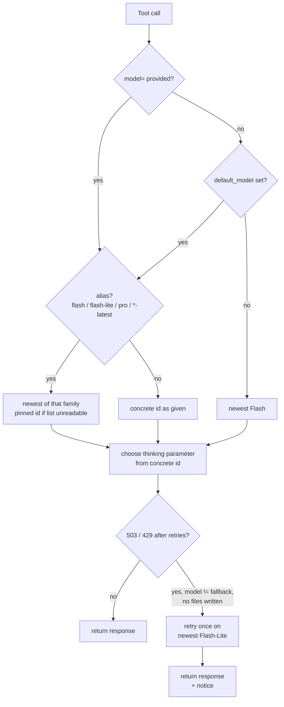

# Configuration Reference

**Config file location:** `~/.config/sidekick/config.json`

Created by `/sidekick:setup`. Safe to edit by hand. The server reads it once at startup, so restart
the MCP server (or Claude Code) after an edit.

`/sidekick:setup` writes only `project`, `location`, `default_thinking`, `default_model` (when you
give one), `transcript_dir` and `auth`. Every other field below is optional and takes its default
until you add it by hand. **Re-running `/sidekick:setup` updates only those fields and leaves the
rest of the file alone** (#85), so an `artifacts_dir`, `file_tools` or `web_tools` you added by hand survives.
A saved `default_model` is kept when you accept the prompt's default; enter `-` to clear it. If
the file is not valid JSON, the wizard moves it aside to `config.json.<timestamp>.bak` — one copy
per broken run, never overwritten (#96) — and starts fresh rather than merging into it. The merged
file is written through a temp file and renamed into place, so an interrupted write cannot leave a
half-written config (#95). A missing file, invalid JSON, or a value that fails validation stops the server
at startup with `Config file not found`, `Config file is not valid JSON`, or
`Config validation failed: …` in the log (see [logging.md](logging.md)). Unknown keys are ignored
silently, so check spelling if a setting seems to have no effect.

## Full example

```json
{
  "project": "my-gcp-project",
  "location": "global",
  "default_thinking": "medium",
  "transcript_dir": "./session-summaries",
  "artifacts_dir": "./gemini-artifacts",
  "file_tools": {
    "enabled": true,
    "max_write_bytes": 262144
  },
  "web_tools": {
    "enabled": false
  },
  "auth": {
    "method": "adc"
  }
}
```

> **Model selection:** leave `default_model` unset to always get the newest Flash (resolved at
> startup), set it to `flash` / `flash-lite` / `pro` to track a family, or to a concrete id to pin
> one. Individual calls always override it **per call** via `model=`. See
> [Choosing a model](#choosing-a-model).

## Field reference

### `project`

**Type:** string
**Example:** `"my-gcp-project"`
**Required when:** `auth.method` is `adc`, `env`, or `keychain`
**Omit when:** `auth.method = "api_key"` (Developer API does not use a GCP project)

Config validation fails at startup if `project` is missing or empty with a Vertex auth method.
Your GCP project ID. Must have the Vertex AI API enabled and `roles/aiplatform.user`
granted to your ADC credentials or service account.

---

### `location`

**Type:** string
**Default:** `"global"`
**Example:** `"us-central1"`

Vertex AI location. `"global"` works for all models and is the recommended default. Only used
by the Vertex AI backends (`adc`/`env`/`keychain`); ignored in `api_key` mode.

`"global"` routes to the lowest-latency region automatically and is the safest choice —
newer models (e.g. `gemini-3.5-flash`) are frequently **global-only**. Set a specific region
(e.g. `us-central1`, `europe-west1`) only if you have a data-residency requirement, and confirm
your chosen model is offered there; a model not served in your region returns a 404 at call time.

> **Note:** The server does not currently validate location against the chosen model at startup —
> `"global"` is recommended precisely because it sidesteps per-model regional gaps.
> (Backend/location-aware validation is tracked as a future enhancement.)

---

### `default_model`

**Type:** string (optional)
**Default:** unset → the newest Flash, resolved from the live model list at startup

Sets the default model for tool calls that omit the `model` parameter. Accepts an alias
(`flash` / `flash-lite` / `pro`, or Google's `-latest` names) to track the newest release of a
family, or a concrete id (e.g. `"gemini-3.5-flash"`) to pin one. Individual calls always override
it via `model=`. The value is not checked when the config loads: a name that isn't a Gemini
model (anything not shaped `gemini-<version>-…`, a `-latest` alias, or a bridge alias) fails every
call that uses it with a `[sidekick error] Unrecognized model family` reply, and a well-formed
id the backend doesn't serve fails with the API's 404. The backend-aware schema hint and
`gemini_list_models` reflect the effective default. See
[Choosing a model](#choosing-a-model).

---

### `default_thinking`

**Type:** string
**Default:** `"medium"`
**Valid values:** `none`, `low`, `medium`, `high` (anything else fails validation at startup)

Used when a tool call omits the `thinking` parameter. Claude overrides this per call when
it judges a different level is appropriate.

---

### `transcript_dir`

**Type:** string (path, `~` and `.` expanded relative to the project root)
**Default:** `"./session-summaries"`

Directory where transcript files are written. Created if it doesn't exist; if it can't be
created (read-only parent, permission denied) the server stops at startup with
`Transcript directory cannot be created: …` instead of a traceback (#87). Transcript files
are named `YYYYMMDD-HHMM-sidekick-transcript.md` using the server startup time.

The project root is `CLAUDE_PROJECT_DIR` when Claude Code sets it, otherwise the server's
working directory (#102). The default `./session-summaries` resolves relative to that root —
transcripts land in `your-project/session-summaries/` automatically, one directory per project.
Override with an absolute path (e.g. `"~/gemini-transcripts"`) to collect transcripts globally
instead.

---

### `artifacts_dir`

**Type:** string (path, relative to the project root — see `transcript_dir` above)
**Default:** `"./gemini-artifacts"`

Where `gemini_architect` and `gemini_review` (and `gemini_brainstorm` with `write_artifact=true`)
save their answers. Created on first save. It **must lie inside the project root and outside the
deny-list** — the server refuses to start otherwise (the log shows
`startup failed — artifacts_dir …`). This check runs even when `file_tools.enabled` is `false`,
because artifacts are written by the bridge, not by Gemini. `~` is not expanded here; use a
relative path or an absolute path inside the project. Add the directory to `.gitignore` or commit
it, per project.

---

### `web_tools.enabled`

**Type:** boolean
**Default:** `false`

```json
"web_tools": { "enabled": false }
```

Default answer for every tool's `web` argument. `false` (the default) means a call must pass
`web=true` to let Gemini search the web and fetch URLs; `true` flips it, and calls pass
`web=false` to opt out.

Off by default because **grounding is billed per request** whenever the tools are attached,
even when Gemini does not search.

**This setting changes what a write-capable call can do.** Web access and `write_file` are
mutually exclusive (see [tools.md](tools.md#web-access)), so with `enabled: true`,
`gemini_brainstorm`, `gemini_review` and `gemini_architect` lose `write_file` unless the call
passes `web=false`. Turning this on is therefore a change to your write workflow, not only to
what Gemini can read.

**Developer API only.** Web access works only with `auth.method = "api_key"`. On Vertex AI
(`adc`, `env`, `keychain`) the setting and any `web=true` are accepted but dropped: the call runs
without web access, keeps its normal file tools (including `write_file` where the tool has it),
and the reply starts with a `[sidekick notice]` saying the answer is not web-grounded. Tool
descriptions on Vertex say web access is unavailable.

---

### `file_tools.enabled`

**Type:** boolean
**Default:** `true`

Master switch for Gemini's repository access (`list_dir`, `glob`, `grep`, `read_file`,
`write_file`). `false` declares no file tools to Gemini at all, so you must paste any code you want
considered into the call. Web access (`web_tools`) is separate and unaffected. Artifacts are
unaffected too (they are written by the bridge, not by Gemini).

File tools are also switched off automatically when Claude Code is launched from your home
directory, the filesystem root, or any directory containing your home directory — a sandbox
rooted there would expose `~/.ssh`, cloud credentials, and shell history.

---

### `file_tools.deny`

**Type:** list of glob patterns
**Default:** `[".git/**", ".env", ".env.*", "**/*.pem", "**/*.key", "**/*.p12", "**/*.pfx", "**/id_rsa*", "**/id_dsa*", "**/id_ecdsa*", "**/id_ed25519*", "**/*credentials*.json", "**/*-sa-key.json", ".ssh/**", ".aws/**", ".gnupg/**", ".netrc", ".npmrc", ".pypirc"]`

Paths Gemini can never read, list, search, or write, even inside the project root. Matched
case-insensitively **at any depth**: a pattern without `/` matches a file or directory name
anywhere; `dir/**` covers any directory named `dir` and everything in it (so `.git/**` also
covers a nested `vendor/lib/.git/`).
**Setting this replaces the defaults** — copy them into your list if you want to keep them.
An empty list (`[]`) means no deny-list at all; the tool descriptions say so.

---

### `file_tools.max_write_bytes`

**Type:** positive integer (0 or negative fails validation)
**Default:** `262144` (256 KiB)

Largest content a single `write_file` call may write. The tool descriptions quote this number.

---

### `auth.method`

**Type:** string
**Default:** `"adc"`
**Valid values:** `adc`, `env`, `keychain`, `api_key`

See [auth.md](auth.md) for full setup instructions for each method.

---

### `auth.keychain_service`

**Type:** string
**Default:** `"sidekick"`
**Only used when:** `auth.method = "keychain"`

The service name used in `security find-generic-password -s {service}`.

---

### `auth.keychain_account`

**Type:** string
**Default:** `"vertex-sa"`
**Only used when:** `auth.method = "keychain"`

The account name used in `security find-generic-password -a {account}`.

---

### `auth.api_key_env`

**Type:** string
**Default:** `"GEMINI_API_KEY"`
**Only used when:** `auth.method = "api_key"`

The name of the environment variable holding your Google AI Studio API key. The key itself
is never stored in `config.json` — only the variable name. At server startup, the server
reads the key from this env var and exits with an error if it is unset or empty. If the value
looks like a key rather than a name (starts with `AIza`, contains lowercase letters, or is longer
than 40 characters), startup fails with a message telling you to put the variable name here.

Common values: `"GEMINI_API_KEY"` (AI Studio default), `"GOOGLE_API_KEY"` (alternative).
The bridge reads only the variable named here and passes that key to the SDK explicitly, so a
second key variable in your environment is not used.

---

## Choosing a model

Every tool accepts an optional `model=` parameter.

| You pass | You get |
|---|---|
| *(nothing)* | `default_model` if set, else the **newest Flash** |
| `flash` · `flash-lite` · `pro` | the newest release of that family |
| `gemini-flash-latest` · `gemini-flash-lite-latest` · `gemini-pro-latest` | same as the short alias; translated by the bridge, so they work on **both** backends |
| a concrete id, e.g. `gemini-3.5-flash` | exactly that model, never rewritten |

- **How "newest" is found:** once at startup the bridge reads the live model list and, per family,
  takes the highest `gemini-<major>.<minor>-<family>` version (compared numerically, so 3.10 beats
  3.8). At the same version a GA model beats its `-preview`; a newer preview beats an older GA —
  which is how `pro` currently resolves to `gemini-3.1-pro-preview` (no newer GA Pro exists).
  Specialized variants (`-customtools`, `-tts`, `-image`, dated builds) are never chosen. The
  result matches Google's own `-latest` aliases (verified live 2026-09-17). Restart the MCP
  server to pick up a new release; the choice never changes mid-session.
- **Fallback:** each request is retried up to 3 times with backoff on 503/429. If it still fails,
  the call is retried once on the newest Flash-Lite (unless that is the model that just failed)
  and the response is prefixed with a visible `[sidekick notice]`. If
  Gemini already wrote a file during that call, it is not retried (writes are never replayed).
- **Offline:** if the model list can't be read at startup, the pinned defaults are used —
  `gemini-3.5-flash`, fallback `gemini-3.1-flash-lite`, Pro `gemini-3.1-pro-preview` — and a
  warning is logged.
- **Visibility:** the startup log line names `default_model` and `fallback_model` as concrete ids
  plus the resolved `flash=… flash-lite=… pro=…`; artifacts record the concrete model
  (transcripts don't record it). `gemini_list_models` marks `(default)` and `(latest <family>)`.

### Thinking levels per model

The `thinking` level (`none` / `low` / `medium` / `high`) maps to a different API parameter per
generation, decided from the **concrete** model id (never an alias):

| Generation | API parameter | `none` / `low` / `medium` / `high` |
|---|---|---|
| Gemini 2.x | `thinking_budget` | 0 / 1024 / 8192 / 32768 tokens (Pro models: minimum 128) |
| Gemini 3 and later | `thinking_level` | `MINIMAL` / `LOW` / `MEDIUM` / `HIGH` |

Some models reject specific values. The bridge adapts automatically, retries once, remembers the
adjustment for that model for the rest of the process, and logs a warning:

| API rejection (verbatim) | Bridge response | Seen on (2026-09-17) |
|---|---|---|
| `Thinking level MINIMAL is not supported for this model` | step **up** to the next level (`MINIMAL` → `LOW`) | `gemini-3.8-flash`, `gemini-3.1-pro-preview` |
| `Thinking level is not supported for this model` | switch that model to `thinking_budget` | `gemini-2.5-flash` |
| `Budget 0 is invalid. This model only works in thinking mode.` | raise that model's budget floor to 128 | `gemini-3.1-pro-preview`, `gemini-3.5-flash-lite` |

Adjustments only ever go **up** in cost, so `thinking="none"` means "the cheapest level this
model accepts". An unrecognized model name raises a `ClientError` at call time.

> **Gemini 2.5 retires 2026-10-16.** `gemini-2.5-pro` already returns 404 on the Developer API for
> new users. The resolver never selects 2.5 while a 3.x model exists.

### How a model value is resolved


