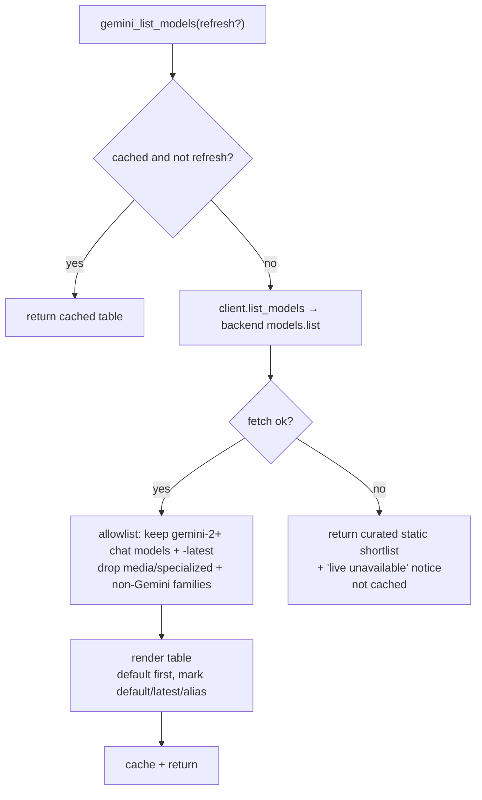

# Tools Reference

Seven tools: five generating tools (`gemini_ask`, `gemini_brainstorm`, `gemini_review`,
`gemini_debug`, `gemini_architect`) that call Gemini, and two utilities that do not generate:
[`gemini_list_models`](#gemini_list_models) and [`gemini_help`](#gemini_help).

The five generating tools share four optional parameters:
- `thinking: "none" | "low" | "medium" | "high"` — reasoning depth; omit to use `default_thinking`
  in config. If a model rejects a level, the bridge steps up to the next one it accepts and
  remembers that for the rest of the process.
- `session_name: str` — which conversation to continue (default `"default"`). Calls sharing a
  name continue one Gemini conversation; a new name starts fresh. Sessions are separate per
  tool and per model, live in memory until the server restarts, and the least recently used is
  dropped past 50. **After a `web=true` call, use a new name before asking for writes** — see
  [What persists between calls](#what-persists-between-calls). That advice appears in the
  parameter's own description only on the three `write_file` tools, and only while file tools
  are on.
- `web: bool` — let Gemini search the web and fetch URLs for this call; omit to use
  `web_tools.enabled`. **While web access is on, `write_file` is withheld** — see
  [Web access](#web-access).
- `model: str` — `flash` / `flash-lite` / `pro` (or Google's `gemini-flash-latest`,
  `gemini-flash-lite-latest`, `gemini-pro-latest`) for the newest release of a family, or any
  Gemini model id; omit for the server default (config `default_model`, else the newest Flash
  resolved at startup). The parameter's description is **backend-aware**: it names the concrete
  id each alias resolved to, the recommended ids for your active backend, and the default.
  Sessions are keyed by tool + `session_name` + resolved model, so switching model starts a
  fresh session. Call [`gemini_list_models`](#gemini_list_models) to discover valid values, and
  see [configuration.md](configuration.md#choosing-a-model) for the recommended set and fallback
  behavior.

Every generating call appends an entry to the session transcript — see
[transcripts.md](transcripts.md).

---

## Repository access

Gemini can inspect — and for some tools, write to — the repository Claude Code was launched in.
Gemini never touches disk itself: it *requests* a tool call, and the bridge runs it locally
inside a sandbox, then sends the result back. One MCP call allows up to 20 rounds of such
requests; after that Gemini is told to answer with what it has.

| Tool | Read tools | `write_file` | Saves answer as artifact |
|---|---|---|---|
| `gemini_ask` | ✅ | — | — |
| `gemini_debug` | ✅ | — | — |
| `gemini_brainstorm` | ✅ | ✅ | opt-in (`write_artifact=true`) |
| `gemini_architect` | ✅ | ✅ | **default** (`write_artifact=false` to skip) |
| `gemini_review` | ✅ | ✅ | **default** (`write_artifact=false` to skip) |

**Tools Gemini can call** (paths are relative to the repo root):

| Tool | Does | Cap |
|---|---|---|
| `list_dir(path=".")` | Directory entries: name, type, and size for files; denied entries are omitted | 500 entries |
| `glob(pattern)` | Files matching a glob; `**/` spans directories, `*` stays in one | 500 results |
| `grep(pattern, path=".", glob=None)` | Python-regex search; returns path, line number, text. `glob` filters by file name (`*.py`) or, with a `/`, by path (`src/**`). Lines over 2,000 characters are skipped | 200 matches; 5,000 files / 20 MiB scanned; 10 s |
| `read_file(path, offset=0, limit=None)` | Text file contents with `cat -n`-style line numbers, pageable by line (`offset` is 0-based, `limit` is a line count) | 256 KiB returned per call; files over 20 MiB and binary files refused |
| `write_file(path, content)` | Create or overwrite a text file (parent directories created) | `max_write_bytes` (default 256 KiB) |

A result that hits a cap is flagged `truncated=true`; a `grep` that runs out of time returns
`timed_out=true` instead of hanging the call.

**Sandbox rules:**
- Every path is fully resolved (symlinks followed, `..` collapsed) and must stay inside the root —
  traversal, absolute paths elsewhere, and symlink escapes are rejected.
- The deny-list (`.git/**`, `.env`, `.env.*`, `*.pem`, `*.key`, `*.p12`, `*.pfx`, `id_rsa*`,
  `id_dsa*`, `id_ecdsa*`, `id_ed25519*`, `*credentials*.json`, `*-sa-key.json`, `.ssh/**`,
  `.aws/**`, `.gnupg/**`, `.netrc`, `.npmrc`, `.pypirc`) is checked case-insensitively, **at any
  depth** (so a nested `vendor/x/.git/` is covered), on both the requested and the resolved path.
  Setting `file_tools.deny` in config replaces this list rather than extending it.
- File tools switch themselves off when Claude Code is launched from your home directory, the
  filesystem root, or any folder containing your home directory, or when
  `file_tools.enabled` is `false`. The startup log line says which.
- `glob` and `grep` skip `.venv`, `venv`, `node_modules`, `__pycache__`, `dist`, `build`,
  `.mypy_cache`, `.pytest_cache` and `.ruff_cache`, and never follow symlinked directories.
  Those folders are still readable by direct path, so searches are **not exhaustive**: an empty
  `grep` is not proof that a symbol is absent.
- Writes are atomic, keep the file's existing permissions (e.g. an executable script stays
  executable), and replace a symlink at the target rather than writing through it. There is no
  delete, rename, chmod, or execute — nothing in the bridge spawns a process.
- If the model is overloaded (503/429) **after** Gemini has written a file during the call, the
  bridge returns an error instead of re-running the call on the fallback model, so writes are
  never replayed.
- Every call, including rejections, is listed under **Tool calls** in the transcript entry.

**How the calling client learns about this.** The capability is advertised to the MCP client,
not just to Gemini, so a Claude session knows to name paths instead of pasting file contents and
knows which calls may touch the working tree. Every channel is computed from the live
workspace at registration, so none can drift from the capability actually wired up:

- **Server instructions** — a short overview sent on connect (`guide.py`): each tool in one
  line, the sandbox root and deny summary, which tools can `write_file`, when to use `web=true`
  and the new-`session_name` rule, and the parameters that change behavior. Claude Code keeps
  only about the first 2048 characters of a server's instructions and silently drops the rest
  (#78), so this text is held under 2000 characters in every configuration, and a test enforces
  that. When file tools are off, it states the reason instead.
- **`gemini_help`** — the detail that does not fit: the full deny-list, the directories
  `glob`/`grep` skip, the result caps and write cap, the web rules, sessions, and everything that
  reaches disk (the transcript path and which tools save artifacts). See
  [gemini_help](#gemini_help).
- **Tool descriptions** — each generating tool's description adds its repository-access
  sentence, a "Writes to disk" clause naming the transcript entry, `write_file` where the tool
  has it, and the artifact if it saves one, and ends with its web-access note.
- **Tool annotations** — `destructiveHint` is set on exactly the three `write_file` tools, and
  only while file tools are enabled. Artifact saving does not set it: the store always creates a
  new file (`-2`, `-3` … on collision) and never overwrites. `readOnlyHint` is false on the five
  generating tools, because every one of them appends to the transcript, and true on
  `gemini_list_models` and `gemini_help`, which write nothing — a client that gates
  auto-approval on annotations would otherwise prompt for the harmless calls and wave the rest
  through. `openWorldHint` is true on every tool that reaches the Gemini API (all but
  `gemini_help`).

Every advertised value is read from whatever enforces it, never restated: the capability rows
from the `CAPABILITY` each tool module exports (built from its own `_WRITE`, `_ARTIFACTS` and
`_DESCRIPTION`), the tool names from `READ_TOOL_NAMES` / `WRITE_TOOL_NAME` (derived from the
declarations that build the registry), the deny-list from `Sandbox.deny`, the skipped
directories from `WALK_SKIP_DIRS` minus whatever the deny-list already blocks, the result caps
from the `*_MAX_*` constants `file_tools.py` enforces, and the write cap from
`FileTools.max_write_bytes`. So changing a tool's capability row means changing `_WRITE` /
`_ARTIFACTS` in its module and nothing else — the tool's description, the server instructions
and `gemini_help` all follow.

`tests/test_capability_metadata.py` runs each tool and compares the files that actually appear
against what the text promised, so wording that over- or under-claims fails the suite.

**Artifacts** land in `artifacts_dir` (default `./gemini-artifacts/`, which must be inside the
sandbox root and not denied, or the server refuses to start) as
`YYYYMMDD-HHMM-<tool>-<topic-slug>.md` — for example
`20260921-1432-gemini-review-is-there-a-race-condition-in.md`. The slug comes from `question`
(else `content` / `description`) for review and architect, and from `topic` for brainstorm. The
file starts with a header naming the tool, model, session, and time, followed by the answer
(including any sources footer). The reply ends with `[gemini-bridge] artifact saved: <path>`,
relative to the repo root. If saving fails you still get the answer, plus a
`[gemini-bridge notice] artifact not saved: …` line. Artifacts are written by the bridge, not
by Gemini, so they are saved even when file tools are off.

---

## Web access

Gemini can search the web and fetch URLs during a call, using the Gemini API's **built-in**
`google_search` and `url_context`. Unlike the file tools, the bridge does not execute these —
the API runs them server-side and returns the result inside the same response. There is no
sandbox to enforce and no handler to write; what the bridge decides is only whether to attach
them. Both are attached together or not at all.

**Turning it on.** `web_tools.enabled` in config sets the default (ships `false`). Every
generating tool takes `web: bool | null`, where `null` uses the config default:

```
gemini_ask(prompt="...", web=true)
```

Grounding is billed per request whenever the tools are attached, even if Gemini does not
search — which is why the default is off.

### Web access and `write_file` are mutually exclusive

**If web access is on for a call, `write_file` is not offered to Gemini at all.**

A web page is attacker-controlled text. Once it is in the context of a call that can write to
your repository, *"write this to `setup.sh`"* is a plausible instruction for the model to
follow. The deny-list blocks `.git`, `.env` and key files, but a CI workflow, a test file or a
shell script inside the repo are all writable and all consequential.

The cost is low, because the bridge writes artifacts itself: a web-enabled `gemini_review`
still produces its artifact. What it loses is Gemini writing directly into the tree during that
same call. When you want both, make two calls — one with `web=true` to research, one with
`web=false` and a new `session_name` to write.

One function, `resolve_capabilities()` in `web_tools.py`, implements this rule. `call_gemini()`
calls it once per call, and the result decides both the tools handed to Gemini and what its
system instruction says it can do. The advertised text (tool descriptions, instructions,
`gemini_help`) states the same rule in words; it does not call the function.

### What is recorded

Server-side calls never reach `ToolRegistry`, so they would otherwise leave no trace. Grounding
metadata is written into the transcript beside the file-tool calls:

```
- → read_file(path='src/gemini_bridge/web_tools.py') → 3.6 KiB
- → google_search(query='"url_context" google-genai sdk') → 2 source(s): google.com, google.dev
- → url_context(url='https://peps.python.org/pep-0020/') → retrieved
```

Searches and URL fetches are recorded separately, because the API reports them separately:
searches arrive in `grounding_metadata`, fetches in `url_context_metadata`. A fetch that
produces no grounding chunks is still logged with its URL, and a failed retrieval is logged as
a failure (`✗ url_context(…) → not retrieved (<status>)`) — otherwise a URL could enter the
context leaving no trace. The `google_search` line names up to five sources by **title** (the
site), because the raw URI is an opaque grounding redirect; the real URLs are in the sources
footer below.

**Sources in the reply (#80, #82).** A web-grounded answer ends with the pages it drew on, so the
caller can check a claim instead of taking it on trust:

```
[gemini-bridge] Sources the bridge recorded from Google's grounding metadata (these are not typed by Gemini):
1. ai.google.dev — https://ai.google.dev/gemini-api/docs/models/gemini-3.1-pro-preview
2. https://docs.python.org/3/whatsnew/3.14.html
```

A search source shows `title — URL`; a fetched URL is listed on its own. When Google reports no
title for a source, it is named after the hostname of its resolved URL (#90). If the answer
itself contains links — Gemini is told not to write them, but an explicit request like "include
links to your sources" overrides that — the footer opens with a line saying those were typed by
Gemini and may be fabricated, and that the recorded list below is the authoritative one (#92).
The answer is never rewritten: stripping URLs would mangle code blocks and quoted text. The list
comes from
the API's grounding metadata, not from Gemini's text, and is deduplicated by final URL. Gemini
is told not to write URLs itself and to name a source by its site or title instead, because when
asked to cite it produces plausible but wrong ones. If the call fell back to another model, only
the sources of the attempt that produced the answer are listed.

Search results arrive as Google's grounding redirect links
(`vertexaisearch.cloud.google.com/grounding-api-redirect/…`). The bridge resolves each one with a
single `HEAD` request that is not followed: the redirect's `Location` is the real page. This
costs **zero Gemini tokens**, downloads no page, and runs for all sources in parallel with a
3-second timeout. A source that does not resolve keeps its redirect link, marked `(unresolved
Google redirect)`, and never fails the call. Only grounding redirect links are requested;
fetched URLs are already real and are listed as they are. The reply shows up to 30 sources,
then `… and N more (see the transcript)`; the transcript lists all of them.

### What persists between calls

The exclusion above is per call, so session history has to be handled too. The API returns its
server-side `tool_call` / `tool_response` parts — which hold retrieved page text — inside the
same object as the answer. The bridge strips them before committing the turn to session
history, keeping only the answer. Without that, a later `web=false` call in the same session
would replay the retrieved text *and* hold `write_file`: two calls each honouring the rule
would together defeat it.

**Residual risk:** Gemini's own answer does persist, and an injection that survived into that
answer would persist with it. That answer was returned to you first, so it is visible rather
than silent, but it is not a guarantee. The clean reset is a new `session_name` for the call that
writes — the server instructions and the write tools' `session_name` description tell every
Claude session to do exactly that.

### Limits and caveats

- Retrieved content is untrusted. Gemini's system instruction says so explicitly, and the tool
  descriptions tell the caller, but treat a web-grounded conclusion as a claim to check.
- **Web access does not work on Vertex.** Not merely untested: the google-genai SDK raises
  `ValueError: include_server_side_tool_invocations parameter is only supported in Gemini
  Developer API mode` when converting the request. `google_search` and `url_context` themselves
  convert fine, but the flag that lets them share a request with the bridge's file tools is
  Developer-API only, and the file tools are almost always on. On a Vertex backend the bridge
  drops web access rather than failing the call (the tool keeps `write_file`, since no web
  content is in play), and the reply opens with `[gemini-bridge notice] Web access was requested
  but is unavailable on the <method> backend, so this answer is not web-grounded.` That applies
  when web access comes from `web_tools.enabled` too. The tool descriptions, server instructions
  and `gemini_help` say web access is unavailable.
- Other built-in tools the SDK exposes — `exa_ai_search`, `mcp_servers`, `code_execution`,
  `file_search` — are deliberately not enabled.

---

## gemini_ask

**Persona:** Direct, precise technical assistant. No specialized persona — use when no other tool fits.

**System prompt:**
> You are a knowledgeable technical assistant working alongside Claude, another AI. Answer
> directly and precisely. Prefer concrete examples. When uncertain, say so.

**Parameters:**
| Parameter | Type | Default | Description |
|---|---|---|---|
| `prompt` | string | required | The question or request |
| `thinking` | string | config `default_thinking` | Reasoning depth |
| `session_name` | string | `"default"` | Conversation to continue |
| `model` | string | server default (newest Flash) | `flash` / `flash-lite` / `pro` or a model id |
| `web` | bool | config `web_tools.enabled` | Let Gemini search the web and fetch URLs |

**When to use:**
- Direct questions with clear answers
- API lookups, syntax questions
- Anything that doesn't fit the specialized tools

**Example:**
```
gemini_ask(prompt="What's the difference between asyncio.gather and asyncio.wait?")
```

---

## gemini_brainstorm

**Persona:** Creative thinking partner. Challenges Claude's direction, pushes unconventional approaches, plays devil's advocate.

**System prompt:**
> You are a creative thinking partner working alongside Claude, another AI. Push unconventional
> approaches. Challenge Claude's existing direction. Play devil's advocate when useful. Offer
> alternatives even when the current path seems fine. Be concise.

**Parameters:**
| Parameter | Type | Default | Description |
|---|---|---|---|
| `topic` | string | required | The topic or problem to brainstorm about |
| `context` | string | `""` | What Claude is currently doing or has considered |
| `thinking` | string | config `default_thinking` | Reasoning depth |
| `session_name` | string | `"default"` | Conversation to continue |
| `model` | string | server default (newest Flash) | `flash` / `flash-lite` / `pro` or a model id |
| `web` | bool | config `web_tools.enabled` | Let Gemini search the web; withholds `write_file` for the call |
| `write_artifact` | bool | `false` | Save the ideas to `artifacts_dir` |

**When to use:**
- Design decisions where you want a second take
- Stuck on an approach and need alternatives
- Validating a plan by stress-testing it

**Example:**
```
gemini_brainstorm(
    topic="How should we structure retry logic for the Pub/Sub consumer?",
    context="Currently planning exponential backoff with a dead-letter queue"
)
```

---

## gemini_review

**Persona:** Critical technical reviewer. Finds problems, prioritizes by severity, doesn't soften feedback.

**System prompt:**
> You are a critical technical reviewer working alongside Claude, another AI. Find problems,
> risks, and weaknesses in code, designs, and plans. Be direct. Don't soften feedback.
> Prioritize by severity. If something is sound, say so briefly and move on.

**Parameters:**
| Parameter | Type | Default | Description |
|---|---|---|---|
| `content` | string | required | Code, design, or plan to review — or the paths Gemini should read |
| `question` | string | `""` | Specific question to focus the review |
| `thinking` | string | config `default_thinking` | Reasoning depth |
| `session_name` | string | `"default"` | Conversation to continue |
| `model` | string | server default (newest Flash) | `flash` / `flash-lite` / `pro` or a model id |
| `web` | bool | config `web_tools.enabled` | Let Gemini search the web; withholds `write_file` for the call |
| `write_artifact` | bool | `true` | Save the answer to `artifacts_dir` |

**When to use:**
- Code review before merging
- Design review for a proposed architecture
- Checking a plan for risks before executing

**Example:**
```
gemini_review(
    content="Review src/gemini_bridge/client.py, the session cache in particular.",
    question="Is there a race condition in the session cleanup logic?"
)
```

---

## gemini_debug

**Persona:** Systematic debugging assistant. Generates evidence-based root cause hypotheses and specific diagnostic steps.

**System prompt:**
> You are a systematic debugging assistant working alongside Claude, another AI. Generate
> root cause hypotheses from the evidence provided. Reason through failure modes. Suggest
> specific diagnostic steps. Don't guess without basis — reason from what's shown.

**Parameters:**
| Parameter | Type | Default | Description |
|---|---|---|---|
| `error` | string | required | Error message, stack trace, or failure description |
| `context` | string | `""` | Relevant code, recent changes, environment details |
| `thinking` | string | config `default_thinking` | Reasoning depth (use `high` for complex failures) |
| `session_name` | string | `"default"` | Conversation to continue |
| `model` | string | server default (newest Flash) | `flash` / `flash-lite` / `pro` or a model id |
| `web` | bool | config `web_tools.enabled` | Let Gemini search the web and fetch URLs |

**When to use:**
- Unexplained test failures
- Production errors with unclear root cause
- Intermittent bugs that are hard to reproduce

**Example:**
```
gemini_debug(
    error="ConnectionResetError: [Errno 54] Connection reset by peer",
    context="Happens only on the 3rd request to the Pub/Sub emulator, after a 30s idle period"
)
```

---

## gemini_architect

**Persona:** Software architecture advisor. Opinionated when a clearly better path exists, names tradeoffs explicitly when context-dependent.

**System prompt:**
> You are a software architecture advisor working alongside Claude, another AI. Evaluate
> system designs, suggest patterns, identify scalability and maintainability concerns.
> Be opinionated when a clearly better path exists. Name tradeoffs explicitly when the
> choice is genuinely context-dependent.

**Parameters:**
| Parameter | Type | Default | Description |
|---|---|---|---|
| `description` | string | required | System design or architecture to evaluate |
| `question` | string | `""` | Specific architecture question or concern |
| `thinking` | string | config `default_thinking` | Reasoning depth (use `high` for complex systems) |
| `session_name` | string | `"default"` | Conversation to continue |
| `model` | string | server default (newest Flash) | `flash` / `flash-lite` / `pro` or a model id |
| `web` | bool | config `web_tools.enabled` | Let Gemini search the web; withholds `write_file` for the call |
| `write_artifact` | bool | `true` | Save the answer to `artifacts_dir` |

**When to use:**
- Choosing between architectural patterns
- Evaluating a design for scalability or maintainability concerns
- Getting an opinion on a technical direction before committing

**Example:**
```
gemini_architect(
    description="We're building a multi-tenant SaaS on GCP. Each tenant gets their own Pub/Sub topic...",
    question="Is per-tenant topic isolation worth the operational overhead at 1000 tenants?"
)
```

---

## gemini_list_models

**Purpose:** Discovery utility — lists the Gemini models available on the bridge's active
backend, so Claude (or you) can pick a valid value for the `model=` parameter. This is a
metadata call, not an inference: it has no `thinking` or `session_name` parameter, writes
nothing, and is not recorded in the transcript.

**Parameters:**
| Parameter | Type | Default | Description |
|---|---|---|---|
| `refresh` | bool | `false` | Re-fetch the live list, bypassing the per-process cache |

**Behavior:**
- Fetches the live catalog via the backend's `models.list`, then keeps only models the bridge
  can actually run — an **allowlist**: Gemini chat generations from `gemini-2` up (`gemini-2*`,
  `gemini-3*`, and any later major version, dotted or hyphenated) plus `-latest` aliases.
  Where the catalog reports supported actions, the model must also support `generateContent`.
  Everything else is dropped:
  - media/specialized variants by name marker — `image`, `tts`, `audio`, `embedding`, `live`,
    `computer-use`, `robotics`, `omni` (several of these report `generateContent` too, so a
    name check is required — the action alone is not sufficient);
  - non-Gemini families the bridge can't run — Gemma, Lyria, Nano-Banana, Antigravity,
    Deep Research, etc.
  - **Previews are kept** (e.g. `gemini-3-pro-preview`) — they are valid, usable models.
- Renders a compact table: model id, display name, and markers — `default`, `latest <family>`
  for the id each alias resolved to at startup, and `alias` for `-latest` names — headed by the
  active backend name. The default is listed first, then the rest alphabetically.
- Caches the result for the process lifetime; `refresh=true` forces a re-fetch.
- **Graceful degradation:** if the live catalog can't be fetched (or has no chat models),
  returns the curated static shortlist (from `models.py`) headed by a
  `[gemini-bridge notice] Live model list unavailable (…)` line instead of failing. That
  result is not cached, so the next call tries the live list again.

> **Note:** the list is a *discovery aid*, not a hard whitelist — an explicitly-requested valid
> model still runs even if it isn't listed (e.g. a specialized `gemini-2*`/`gemini-3*` variant).

**Example:**
```
gemini_list_models()
gemini_list_models(refresh=True)   # force a fresh fetch
```

**Sample output** (api_key / Developer API backend; abridged — your live list reflects the
current catalog):
```
Gemini chat models on Developer API (Google AI Studio) (17 available):

  gemini-3.8-flash                    (default, latest flash)  — Gemini 3.8 Flash
  gemini-3.1-pro-preview              (latest pro)  — Gemini 3.1 Pro Preview
  gemini-3.5-flash                    — Gemini 3.5 Flash
  gemini-3.5-flash-lite               (latest flash-lite)  — Gemini 3.5 Flash Lite
  gemini-flash-latest                 (alias)  — Gemini Flash Latest
  gemini-pro-latest                   (alias)  — Gemini Pro Latest
  …

Pass model='<id>' to any tool. Omit to use the default (gemini-3.8-flash).
Or pass flash / flash-lite / pro to get the newest release of that family.
```
On a Vertex backend the header names Vertex AI and the `-latest` aliases are absent from the
catalog (the bridge still accepts them as `model=` values and resolves them itself).

**How it resolves:**



See [configuration.md](configuration.md#choosing-a-model) for the recommended models per backend.

---

## gemini_help

The full detail behind the short server instructions (#78): the `--help` for Claude. It writes
nothing, makes no Gemini call, and is not recorded in the transcript.

| Parameter | Type | Default | Description |
|---|---|---|---|
| `topic` | string | all topics | `tools`, `files`, `web`, `sessions`, `disk`, or a generating tool's name (e.g. `gemini_review`) |

| Topic | Contents |
|---|---|
| `tools` | Each tool's one-line purpose, for choosing between them |
| `files` | Sandbox root, read tools, full deny-list, directories `glob`/`grep` skip, result caps, which tools may `write_file` and its size cap |
| `web` | Web default, when to pass `web=true`, the untrusted-content rule, and the `write_file` exclusion with the new-`session_name` advice |
| `sessions` | The `session_name` contract |
| `disk` | Everything that reaches disk: the transcript path and which tools save artifacts where |
| `gemini_<tool>` | That tool's full description, as its MCP description states it |

Every topic is built from the live configuration, the same way the instructions are, so it
always matches what the server actually does. Topic names are case-insensitive; an unknown
topic returns the list of valid ones.
